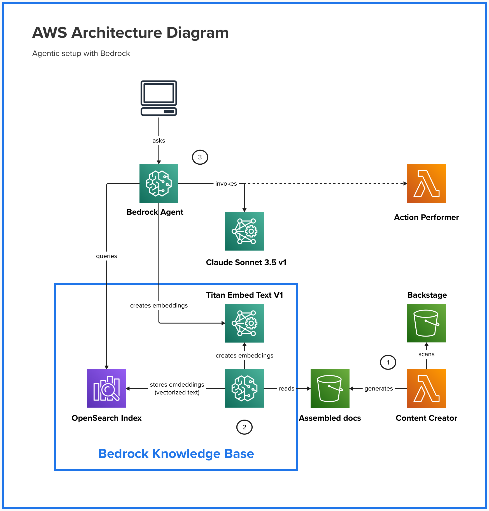

# Backstage AI Agent

This agent provides an interactive communication channel to query an analyze documentation stored in [Backstage](https://backstage.io).




1. For each document entry in Backstage s3 bucket there is a correspondent `search_index.json` that contains all document data.
The data in `search_index.json` is split in chunks (one per subheading). __Content Creator__ function reads each such
a file and assembles those chunks together. It also adds to it backstage links that point to the correspondent chucks of text. 
The resulted documents are stored in Bedrock S3 bucket.
2. Bedrock has an option to build a `Knowledge Base` from the documents. The build process works as follows:
    - The `Knowledge Base agent` takes a document form the s3 bucket and pipes it thorough `amazon.titan-embed-text-v1` model to generate a vector representation of the document text.
    - The `Knowledge Base agent` then stores this vector together with the document text in OpenSearch as `inverted index` for the later use.
3. The `Bedrock Agent` is a middle man that processes user requests. The flow looks as follows:
    - The user sends a query to the `Bedrock Agent`.
    - The `Bedrock Agent` pipes the query through `amazon.titan-embed-text-v1` model to generate a vector representation of the query.
    - The `Bedrock Agent` then sends this vector to OpenSearch to find the most similar documents.
    - The found documents and the query are piped through `anthropic.claude-3-5-sonnet-20240620-v1:0` to get an answer.
    - The `Bedrock Agent` has a set of preconfigured actions that it can perform by invoking __Action Performer__ lambda function. For example, it can check that the Backstage links to the documentation are not broken before returning them to the user.

__Question:__ why to assemble all chunks from `search_index.json` together?

__Answer:__ this allows to store the document in the OpenSearch as a single entity. When a request comes in, OpenSearch 
returns the whole document and not only parts of it. We then pipe entire document through `anthropic.claude-3-5-sonnet-20240620-v1:0` 
model as a context that is used for the answer. This is useful when the user asks a question that spans multiple subheadings.

## Installation

### Pre-requisites
- Thechdocs is deployed following [Recommended Deployment](https://backstage.io/docs/features/techdocs/architecture#recommended-deployment) guide and __AWS S3__ used as a storage. If the bucket is located in another account, then `s3:ListBucket` and `s3:GetObject` permissions should be granted for the target account.
- [Bedrock models](https://docs.aws.amazon.com/bedrock/latest/userguide/models-supported.html) are enabled and allowed in the target AWS Account. Namely `amazon.titan-embed-text-v1` and `anthropic.claude-3-5-sonnet-20240620-v1:0` are used.

The backend is built with CDK using Amplify.

To deploy a sandboxed version of the agent, execute from the root:

```bash
SOURCE_BUCKET_NAME=<your_s3_bucket_name> npx ampx sandbox
```